<!--
  Perfil de GitHub de Webs Creative · https://webscreative.es
  Los gráficos animados viven en assets/profile/ (SVG con la paleta de marca).
-->

<a href="https://webscreative.es/">
  
</a>

 

  

 

<picture>
  <source media="(prefers-color-scheme: dark)" srcset="assets/profile/titles/about-dark.svg"/>
  
</picture>


  

<picture>
  <source media="(prefers-color-scheme: dark)" srcset="assets/profile/titles/services-dark.svg"/>
  
</picture>

<table align="center">
  <tr>
    <td width="33%"><a href="https://webscreative.es/contacto/"></a></td>
    <td width="33%"><a href="https://webscreative.es/"></a></td>
    <td width="33%"><a href="https://webscreative.es/contacto/"></a></td>
  </tr>
  <tr>
    <td width="33%"><a href="https://webscreative.es/contacto/"></a></td>
    <td width="33%"><a href="https://webscreative.es/ia/"></a></td>
    <td width="33%"><a href="https://webscreative.es/categoria-producto/modulos-dolibarr/ia/"></a></td>
  </tr>
</table>

 

<picture>
  <source media="(prefers-color-scheme: dark)" srcset="assets/profile/titles/process-dark.svg"/>
  
</picture>


  

<picture>
  <source media="(prefers-color-scheme: dark)" srcset="assets/profile/titles/stack-dark.svg"/>
  
</picture>

  
   
  
    
  
  
  
  

 

<picture>
  <source media="(prefers-color-scheme: dark)" srcset="assets/profile/titles/stats-dark.svg"/>
  
</picture>

  

<picture>
  <source media="(prefers-color-scheme: dark)" srcset="https://raw.githubusercontent.com/Webs-Creative/Webs-Creative/output/snake-dark.svg"/>
  
</picture>

 

<picture>
  <source media="(prefers-color-scheme: dark)" srcset="assets/profile/titles/social-dark.svg"/>
  
</picture>

<table align="center">
  <tr>
    <td width="33%"></td>
    <td width="33%"></td>
    <td width="33%"></td>
  </tr>
  <tr>
    <td width="33%"></td>
    <td width="33%"></td>
    <td width="33%"></td>
  </tr>
  <tr>
    <td width="33%"></td>
    <td width="33%"></td>
    <td width="33%"><a href="https://github.com/Webs-Creative"></a></td>
  </tr>
</table>

 

<a href="https://webscreative.es/contacto/">
  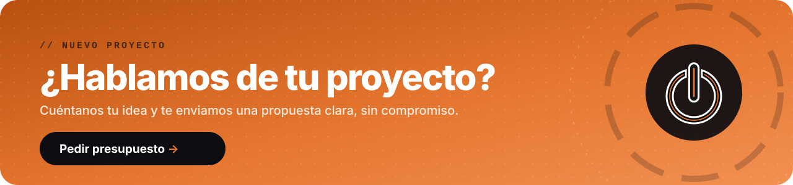
</a>

